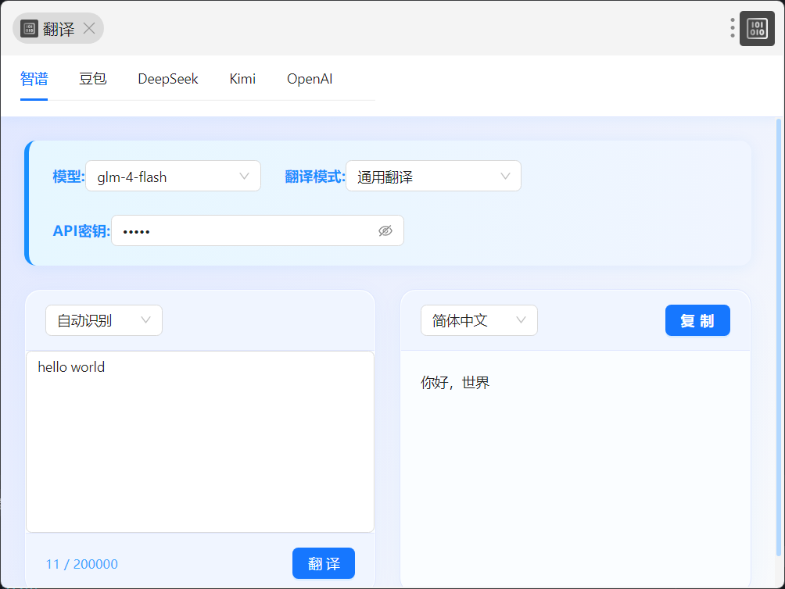

# utools中的翻译插件
## 插件主界面

## glm-4-flash、glm-4.5-flash 模型
免费模型，需要去获取api密钥 https://bigmodel.cn/
## 豆包
需要去火山引擎中的火山方舟获取 api 密钥 https://www.volcengine.com/

## 版本 v1.0.3
1. 增加深色、浅色主题切换按钮
2. 深色主题样式优化
3. 增加智谱选项卡对glm-4.5-flash模型的支持